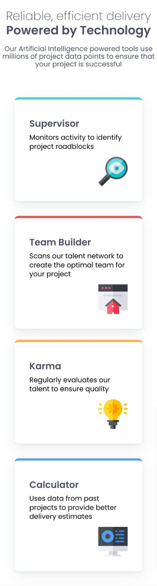

# Four Card Feature Section

A responsive frontend challenge showcasing a four-card feature section, built with HTML and CSS.

## Preview

.png) 
 

## Features

- Responsive grid layout
- Clean, modern design
- Uses [Poppins](https://fonts.google.com/specimen/Poppins) font
- Card highlights with colored borders
- Accessible and semantic HTML

## Getting Started

1. **Clone the repository:**
   ```sh
   git clone https://github.com/your-username/your-repo-name.git
   cd your-repo-name
   ```

2. **Open `index.html` in your browser.**

No build tools or dependencies required.

## Folder Structure

```
index.html
style.css
images/
    favicon-32x32.png
    icon-calculator.svg
    icon-karma.svg
    icon-supervisor.svg
    icon-team-builder.svg
```

## Credits

- Challenge by [Frontend Mentor](https://www.frontendmentor.io/)
- Icons from the challenge assets

## License

This project is open source and available under the [MIT License](LICENSE).
